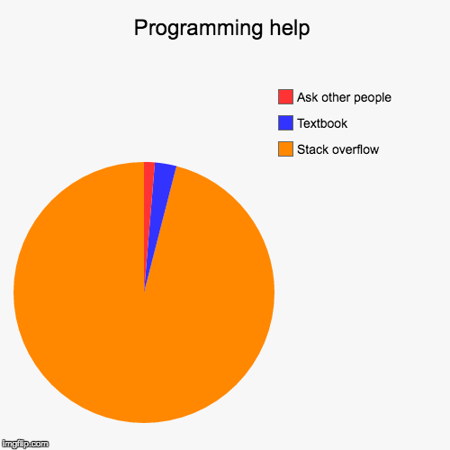

# Self-introduction
자기소개는 자신의 강점을 효과적으로 전달하고, 타인과의 첫인상에서 긍정적인 이미지를 심어주는 중요한 기회,  
이를 통해 관계 형성과 목표 달성을 위한 기초를 마련할 수 있는 좋은 자리이다.

 - 202301909 Global Business Technology
 - 김규민

## *What I learn*

## *What I do*

## Features
수업중 생겨나는 자료들을 보관하기위해 만들었습니다.

<h2>폴더 설명</h2>

book 폴더에는 실습했던 book명령어들이 들어있습니다.

classMd에는 수업시간 필기한 내용이 들어가있습니다.

img에는 README.md에 들어간 이미지들이 보관되어있습니다.

name와 perl.txt는 실습후 남은 자료입니다.

w11.md는 과제입니다.

## Syllabus

본 교과목은 오픈 소프트웨어를 다루기 위해 필수적으로 요구되는 스킬인 깃과 깃허브를 다루는 능력을 배양하기 위해 설계되었다. 
또한 깃을 자유자재로 사용하기 위해 필수적으로 요구되는 셸 스크립트 언어의 기본적인 지식을 습득하고 실습한다.

| 주차 | 강의범위 및 내용 |
| :---: | --- |
| 제 1주 |  [Intro. What is git?](./classMd/1w.md) |
| 제 2주 | [Markup Language 깃 시작하기](./classMd/2w.md)|
| 제 3주 | [버전 관리 - 저장소 만들기 - 커밋 - 작업 돌리기](./classMd/3w.md)  |
| 제 4주 | 	[브랜치 - 브랜치 만들기 - 브랜치 정보 확인 - 브랜치 병합](./classMd/4w.md)  |
| 제 5주 |	 [깃허브 - 지역저장소와 원격저장소 연결 - SSH 원격 접속 ](./classMd/5w.md) |
| 제 6주 | [깃허브로 협업하기](./classMd/6w.md) |
| 제 7주 | [셸 스크립트 기초 문법 - 조건문, 반복문, 연산자 ](./classMd/7w.md)|
| 제 8주 | [Mid-term](./classMd/8w.md) |
| 제 9주 | [grep 사용법: 문자열 다루기](./classMd/9w.md) |
| 제 10주 | 	[find 사용법: 파일 다루기](./classMd/10w.md) |
| 제 11주 | [awk 사용법: 특정 인텍스 문자열 출력하기](./classMd/111w.md) |
| 제 12주 | [sed 사용법: 찾은 문자열 바꾸기](./classMd/12w.md) |
| 제 13주 | [date 사용법: 날짜, 시간](./classMd/13w.md) |
| 제 14주 | [프로젝트](./classMd/14w.md) |
| 제 15주 | [Final](./classMd/15w.md) |

*이건 HTML로 작성해봤읍니다*
<table>
  <tr>
    <th scope="row">주차</th>
    <th scope="row">강의범위 및 내용</th>
  </tr>
  <tr>
    <th scope="row">제 1주</th>
    <td>Intro. What is git?&nbsp;</td>
  </tr>
  <tr>
    <th scope="row">제 2주</th>
    <td>Markup Language 깃 시작하기&nbsp;</td>
  </tr>
  <tr>
    <th scope="row">제 3주</th>
    <td>버전 관리 - 저장소 만들기 - 커밋  - 작업 돌리기&nbsp;</td>
  </tr>
  <tr>
    <th scope="row">제 4주</th>
    <td>브랜치 - 브랜치 만들기 - 브랜치 정보 확인 - 브랜치 병합&nbsp;</td>
  </tr>
  <tr>
    <th scope="row">제 5주</th>
    <td>깃허브 - 지역저장소와 원격저장소 연결 - SSH 원격 접속&nbsp;</td>
  </tr>
  <tr>
    <th scope="row">제 6주</th>
    <td>깃허브로 협업하기&nbsp;</td>
  </tr>
  <tr>
    <th scope="row">제 7주</th>
    <td>셸 스크립트 기초 문법 - 조건문, 반복문, 연산자&nbsp;</td>
  </tr>
  <tr>
    <th scope="row">제 8주</th>
    <td>Mid-term&nbsp;</td>
  </tr>
  <tr>
    <th scope="row">제 9주</th>
    <td>grep 사용법: 문자열 다루기&nbsp;</td>
  </tr>
  <tr>
    <th scope="row">제 10주</th>
    <td>find 사용법: 파일 다루기&nbsp;</td>
  </tr>
  <tr>
    <th scope="row">제 11주</th>
    <td>awk 사용법: 특정 인텍스 문자열 출력하기&nbsp;</td>
  </tr>
  <tr>
    <th scope="row">제 12주</th>
    <td>sed 사용법: 찾은 문자열 바꾸기&nbsp;</td>
  </tr>
  <tr>
    <th scope="row">제 13주</th>
    <td>date 사용법: 날짜, 시간&nbsp;</td>
  </tr>
  <tr>
    <th scope="row">제 14주</th>
    <td>프로젝트&nbsp;</td>
  </tr>
  <tr>
    <th scope="row">제 15주</th>
    <td>Final&nbsp;</td>
  </tr>
</table>

## *What I want*
