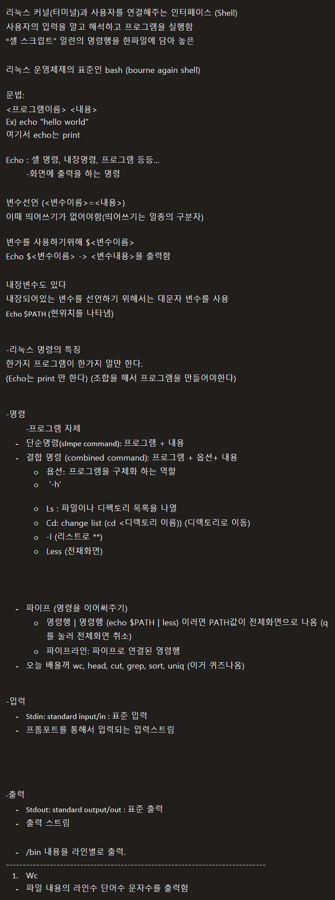

리눅스 커널(터미널)과 사용자를 연결해주는 인터페이스 (Shell)
사용자의 입력을 알고 해석하고 프로그램을 실행함
"셀 스크립트" 일련의 명령행을 한파일에 담아 놓은

리눅스 운영체제의 표준인 bash (bourne again shell)

문법:
<프로그램이름> <내용> 
Ex) echo "hello world"
여기서 echo는 print

Echo : 셀 명령, 내장명령, 프로그램 등등…
	-화면에 출력을 하는 명령

변수선언 (<변수이름>=<내용>)
이때 띄어쓰기가 없어야함(띄어쓰기는 일종의 구분자)

변수를 사용하기위해 $<변수이름>
Echo $<변수이름> -> <변수내용>을 출력함

내장변수도 있다
내장되어있는 변수를 선언하기 위해서는 대문자 변수를 사용
Echo $PATH (현위치를 나타냄)

-리눅스 명령의 특징
한가지 프로그램이 한가지 일만 한다.
(Echo는 print 만 한다) (조합을 해서 프로그램을 만들어야한다)

-명령
	-프로그램 자체
	- 단순명령(slmpe command): 프로그램 + 내용
	- 결합 명령 (combined command): 프로그램 + 옵션+ 내용
		○ 욥션:  프로그램을 구체화 하는 역할
		○  '-h'

		○ Ls : 파일이나 디펙토리 목록을 나열
		○ Cd: change list (cd <디랙토리 이름)) (디랙토리로 이동)
		○ -l (리스트로 **)
		○ Less (전채화면)

	- 파이프 (명령을 이어써주기)
		○ 명령행 | 명령행 (echo $PATH | less) 이러면 PATH값이 전체화면으로 나옴 (q를 눌러 전체화면 취소)
		○ 파이프라인: 파이프로 연결된 영령행
	- 오늘 배울꺼 wc, head, cut, grep, sort, uniq (이거 퀴즈나옴)

-입력
	- Stdin: standard input/in : 표준 입력
	- 프롬포트를 통해서 입력되는 입력스트림

-출력
	- Stdout: standard output/out : 표준 출력
	- 출력 스트림

	- /bin 내용을 라인별로 출력.
-----------------------------------------------------------------------------
	1. Wc
	- 파일 내용의 라인수 단어수 문자수를 출력함
