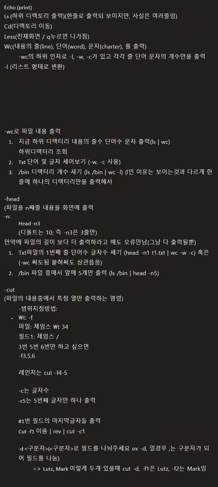

Echo (print)
Ls (하위 디랙토리 출력)(한줄로 출력되 보이지만, 사실은 여러줄임)
Cd(디랙토리 이동)
Less(전채화면 / q누르면 나가짐)
Wc(내용의 줄(line), 단어(word), 문자(charter), 를 출력)
	-wc의 하위 인자로 -l, -w, -c가 있고 각각 줄 단어 문자의 개수만을 출력 
-l (리스트 형태로 변환)

-wc로 파일 내용 출력 
	1. 지금 하위 디랙터리 내용의 줄수 단어수 문자 출력(ls | wc)
	하위디랙터리 조회
	2. Txt 단어 및 글자 세어보기 (-w, -c 사용)
	3. /bin 디랙터리 개수 새기 (ls /bin | wc -l) (l인 이유는 보이는것과 다르게 한줄에 하나의 디랙터리만을 출력해서 

-head
(파일을 n쨰줄 내용을 화면에 출력
-n:
	Head -n3
	(디폴트는 10; 즉 -n3은 3줄만)
만약에 파일의 길이 보다 더 출력하라고 해도 오류안남(그냥 다 출력될뿐)
	1. Txt파일의 1번째 줄 단어수 글자수 세기 (head -n1 t1.txt | wc -w -c) 혹은 (-wc 써도됨 붙혀써도 상관읍음)
	2. /bin 파일 중에서 앞에 5개만 출력 (ls /bin | head -n5)

-cut
(파일의 내용중에서 특정 열만 출력하는 명령)
	-범위지정방법:
	- \t: -f
	파일: 제임스 \t 34
	필드1: 제임스 /
	3번 5번 6번만 하고 싶으면 
	-f3,5,6

	레인지는 cut -f4-5

	-c는 글자수
	-c5는 5번쨰 글자만 하나 출력

	#1번 필드의 마지막글자들 출력
	Cut -f1 이름 | rev | cut -c1

	-d <구분자>(<구분자>로 필드를 나눠주세요 ex -d, 일경우 ,는 구분자가 되어 필드를 나눔)
		=> Lutz, Mark 이렇게 두개 있을때 cut -d, -f1은 Lutz, -f2는 Mark임 

