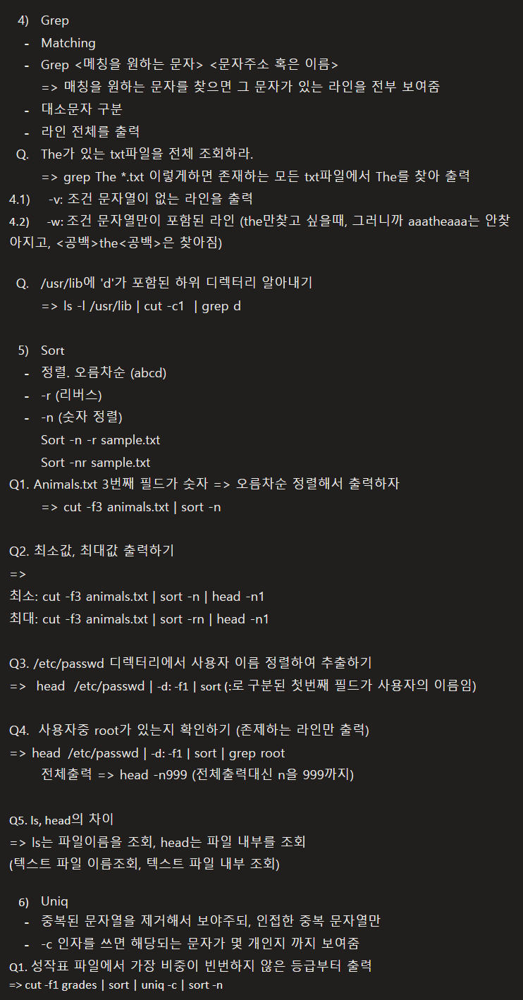

	4) Grep
	- Matching
	- Grep <메칭을 원하는 문자> <문자주소 혹은 이름>
	=> 매칭을 원하는 문자를 찾으면 그 문자가 있는 라인을 전부 보여줌
	- 대소문자 구분
	- 라인 전체를 출력
	Q. The가 있는 txt파일을 전체 조회하라.
	=> grep The *.txt 이렇게하면 존재하는 모든 txt파일에서 The를 찾아 출력
4.1)    -v: 조건 문자열이 없는 라인을 출력
4.2)      -w: 조건 문자열만이 포함된 라인 (the만찾고 싶을때, 그러니까 aaatheaaa는 안찾아지고, <공백>the<공백>은 찾아짐)

	Q. /usr/lib에 'd'가 포함된 하위 디렉터리 알아내기
	=> ls -l /usr/lib | cut -c1  | grep d 

	5) Sort
	- 정렬. 오름차순 (abcd)
	- -r (리버스)
	- -n (숫자 정렬)
	Sort -n -r sample.txt
	Sort -nr sample.txt
Q1. Animals.txt 3번째 필드가 숫자 => 오름차순 정렬해서 출력하자
	=> cut -f3 animals.txt | sort -n

Q2. 최소값, 최대값 출력하기 
=>
최소: cut -f3 animals.txt | sort -n | head -n1 
최대: cut -f3 animals.txt | sort -rn | head -n1

Q3. /etc/passwd 디렉터리에서 사용자 이름 정렬하여 추출하기
=>  head  /etc/passwd | -d: -f1 | sort (:로 구분된 첫번째 필드가 사용자의 이름임)

Q4.  사용자중 root가 있는지 확인하기 (존제하는 라인만 출력)
=> head  /etc/passwd | -d: -f1 | sort | grep root 
	전체출력 => head -n999 (전체출력대신 n을 999까지)

Q5. ls, head의 차이 
=> ls는 파일이름을 조회, head는 파일 내부를 조회
(텍스트 파일 이름조회, 텍스트 파일 내부 조회)

	6) Uniq
	- 중복된 문자열을 제거해서 보야주되, 인접한 중복 문자열만
	- -c 인자를 쓰면 해당되는 문자가 몇 개인지 까지 보여줌
Q1. 성작표 파일에서 가장 비중이 빈번하지 않은 등급부터 출력
=> cut -f1 grades | sort | uniq -c | sort -n
