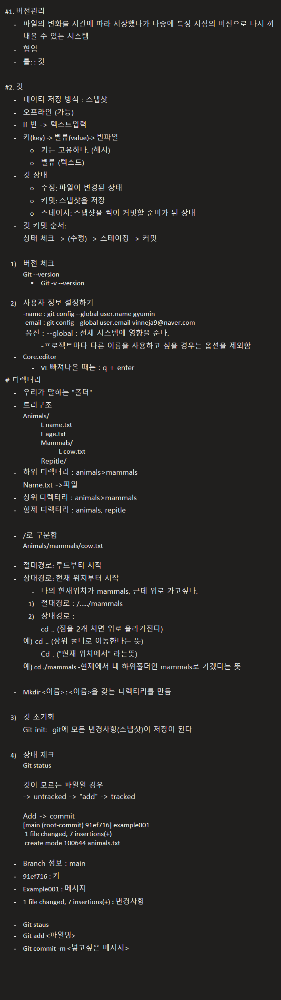

#1. 버전관리
	- 파일의 변화를 시간에 따라 저장했다가 나중에 특정 시점의 버전으로 다시 꺼내올 수 있는 시스템
	- 협업
	- 틀: : 깃

#2. 깃
	- 데이터 저장 방식 : 스냅샷
	- 오프라인 (가능)
	- If 빈 -> 텍스트입력
	- 키(key) -> 벨류(value)-> 빈파일
		○ 키는 고유하다. (해시)
		○ 벨류 (텍스트)
	- 깃 상태
		○ 수정: 파일이 변경된 상태
		○ 커밋: 스냅샷을 저장
		○ 스테이지: 스냅샷을 찍어 커밋할 준비가 된 상태
	- 깃 커밋 순서:
	상태 체크 -> (수정) -> 스테이징 -> 커밋

	1) 버전 체크
	Git --version
		• Git -v --version

	2) 사용자 정보 설정하기
	-name : git config --global user.name gyumin
	-email : git config --global user.email vinneja9@naver.com
	-옵션 : --global : 전체 시스템에 영향을 준다.
		-프로젝트마다 다른 이름을 사용하고 싶을 경우는 옵션을 제외함
	- Core.editor
		- VL 빠져나올 때는 : q + enter
# 디렉터리
	- 우리가 말하는 "폴더"
	- 트리구조
	Animals/
		L name.txt
		L age.txt
		Mammals/
			L cow.txt
		Repitle/
	- 하위 디렉터리 : animals>mammals
	Name.txt ->파일
	- 상위 디렉터리 : animals>mammals
	- 형제 디렉터리 : animals, repitle

	- /로 구분함
	Animals/mammals/cow.txt

	- 절대경로: 루트부터 시작
	- 상대경로: 현재 위치부터 시작
		- 나의 현재위치가 mammals, 근데 위로 가고싶다.
		1) 절대경로 : /…../mammals
		2) 상대경로 : 
		cd .. (점을 2개 치면 위로 올라가진다)
	예) cd .. (상위 폴더로 이동한다는 뜻)
		Cd . ("현재 위치에서" 라는뜻)
	예) cd ./mammals -현재에서 내 하위폴더인 mammals로 가겠다는 뜻

	- Mkdir <이름> : <이름>을 갖는 디렉터리를 만듬

	3) 깃 초기화 
	Git init: -git에 모든 변경사항(스냅샷)이 저장이 된다

	4) 상태 체크
	Git status

	깃이 모르는 파일일 경우 
	-> untracked -> "add" -> tracked

	Add -> commit 
	[main (root-commit) 91ef716] example001
	 1 file changed, 7 insertions(+)
	 create mode 100644 animals.txt

	- Branch 정보 : main
	- 91ef716 : 키 
	- Example001 : 메시지
	- 1 file changed, 7 insertions(+) : 변경사항

	- Git staus
	- Git add <파일명>
	- Git commit -m <넣고싶은 메시지>

