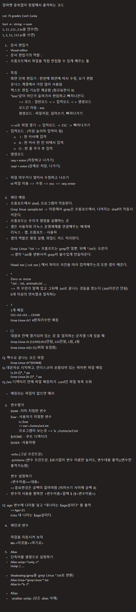

알파벳 중복없이 정렬해서 출력하는 코드

cut -f1 grades |sort |uniq

Sort -n : string -> num
1, 11 ,111 ,2 (n을 안쓰면)
1, 2, 11, 111 (n을 쓰면)

	1. 문서 편집기
	- Visual editor
	- 문서 편집기의 역할 : 
	- 프롬프트에서 파일을 직접 현집할 수 있게 해주는 툴

	- 특징
	화면 단위 편집기 : 한번에 화면에 떠서 수정, 보기 편함
	유닉스 계열에서 가장 많이 사용됨
	텍스트 편집 기능만 제공함 (정규표현식 X)
	"less"같이 어딘가 들어가서 편집하고 빠져나온다.
		=> 모드 : 일반모드 <-> 입력모드 <-> 명령모드
		모드간 이동 : esc
		명령모드 : 파일저장, 덮어쓰기, 빠져나가기

	=> vi로 파일 열기 -> 입력모드 -> ESC -> 빠져나가기
	- 입력모드 : (이걸 눌러야 입력이 됨)
		○  I : 한 커서에 입력 
		○ A : 한 커서 한 칸 뒤에서 입력
		○ O : 한 줄 추가 후 입력
	- 명령모드
	:wq + enter (저장하고 나가기)
	:wq! + enter (강제로 저장, 나가기)

	- 파일 아무거나 열어서 수정하고 나오기
	Vi 파일 이름 => 수정 => esc => :wq enter

	2. 패턴 매칭
	- 프롬포트에서 shell, 프로그램이 작동한다.
	Grep linux sample.txt -> 이중에서 grep은 프롬포트에서, 나머지는 shell이 작동시켜준다. 
	- 프롬포트는 우리가 명령을 실행하는 곳
	- 셸은 사용자와 리눅스 운영체제를 연결해주는 매개체
	리눅스 - 셸, 프롬포트 - 사용자
	- 셸의 역할은 명령 실행, 와일드 카드 처리한다.

	Grep Linux *.txt => 프롬프트는 grep만 알뿐, 뒤에 *.txt는 모른다
	=> 셸이 *.txt를 변환시켜 grep이 볼수있게 만들어준다.

	Head xxx | cut xxx | 에서 파이프 라인을 따라 입력해주는것 또한 셸이 해준다.

	- *
	Zero or more 
	*.txt : .txt, animals.txt ….
	=> 즉 무언가 앞에 있고 그뒤에 .txt로 끝나는 것들을 찾는다 (.txtt이런건 안됨)
	0개 이상의 연속열과 일치하는

	- ?
	1개 매칭
	Ch1 ch2 ch3 ... Ch100
	Grep Linux ch?  #한자리수만 매칭

	- [ ]
	대괄호 안에 열거되어 있는 것 중 일치하는 문자열 1개 있을 때
	Grep Linux ch [12345] #12안됨, 123안됨, 1됨, 2됨
	Grep Linux ch[1-5] (위와 동일함)

Q: 짝수로 끝나는 모든 파일
	Grep Linux ch*[02468]
Q: 대문자로 시작하고, 언더스코어 포함되어 있는 파이썬 파일 매칭
	Ls [A-Z]*_*.py
	Grep Linux [A-Z]*_*.py
Q; /etc 디렉터리 안에 파일 확장자가 .conf인 파일 목록 조회

	- 매칭되는 파일이 없으면 예러

	3. 변수평가
	$VAR - 이미 지정한 변수
	$var - 사용자가 지정한 변수
		Ls $var
		=> var=./notes/w3.txt
		프로그램이 보는것 => ls ./notes/w3.txt
	$HOME - 루트 디렉터리
	$USER -사용자명

	-echo (그냥 프린트문)
	-printenv (변수 프린트문, $표시없이 변수 이름만 눌러도, 변수내용 출력),(변수만 출력가능함)

	변수 설정하기
	<변수이름>=<내용>
	=> 중요한것은 공백이 없어야함 (띄어쓰기 사이에 공백 X)
	- 변수의 사용을 원하면 <변수이름>앞에 $ ($<변수이름>)

Q: age 변수에 나이를 넣고 "내나이는 $age살이다" 를 출력
	=> Age=21
	Echo 내 나이는 $age살이다.

	4. 패턴과 변수

	파일을 이동시켜 보자
	Mv <이것을> <여기로>

	5. Alias
	- 단축어를 별명으로 설정하기
	- Alias uniqc="uniq -c"
	Uniqc | ...

	- Shadowing (grep을 grep Linux *.txt로 변환)
	Alias Grep="grep Linux *.txt
	Alias ls="ls -l"

	- Alias
	-  unalias uniqc (모든 alias 삭제)

