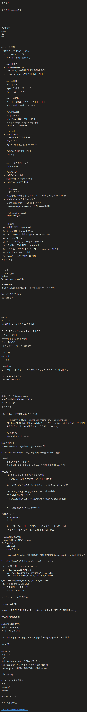

중간고사

여기와서 9~10시까지

-정규표현식
-Grep
-Ed
-sed

#1. 정규표현식
= 와일드카드와 혼동하지 말것
	• ? … chapter*.txt (2장)
	• 패턴 매칭할 때 사용한다.

	##1. 마침표
	- any single characther
	- r.= ro, rc, rk, .. => r뒤에 하나의 문자가 온다
	- .r. = oro, xrt, drt => 앞뒤로 하나의 문자가 온다

	##2. ^ (꺽쇠)
	- 라인의 처음
	- [^] not 의 뜻을 가지고 있음
	- [^a-z] => 소문자가 아닌

	##3. $ (딸라)
	- 라인의 끝 (중요! 라인이다, 단어가 아니라!)
	- ^ $ (시작해서 공백 끝 => 공백)

	##4. [리스트]
	- [a-z] 소문자만
	- [a-np-z] o를 제외한 모든 소문자
	- [a-n][p-z] a~n중 하나랑 p~z중 하나
	- Grep '[Tt]he' animals.txt

	##5. * (별)
	- Zero or more
	- x* => x어쩌구 저져꾸 나옴
	- 앞글자 한정
	-  Q. x로 시작하는 단어 => xx* (o)

	##6. \+ (역슬레시 더하기)
	- 1개 이상
	- x\+

	##7. \? (역슬레시 물음표)
	- Zero or one

	##8. \{I,j\}
	- x\{10\) => 10번
	- x\{1,10\) => 1번에서 10번
	- x\{10,\) => 10번 이상

	##9. \(regex\)
	- 재활용 가능하다
	- '^\(,\)\(,\)\1\1' #동일한 알파벳 2개로 시작하는 라인 * aa, ll, kk 등…
	- '\(a\)\(b\)' a와 b를 저장하고
	- '\(a\)\(b\)\2\1' 하면 ba가 나오고
	-  '\(a\)\(b\)\2\1\1\1\1' 하면 baaaa나온다

	##10. regex1 \| regex2
	- Regex1 or regex2

	#Q. 문제
	1) a-f까지 매칭 => grep [a-f]
	2) B나 ab매칭 => grep B \| ab
	3) 2번 + aaaaaab 매칭 => grep B \| ab aaaaaab
	4) 모든 글자 매칭 =>
	5) #으로 시작하는 문자 매칭 => grep ^'#'
	6) \로 끝나는 문자 매칭 => grep '\'$
	7) 대문자로 시작하지 않는 문자 매칭 =>grep [a-z] \| [1-9]
	8) 빈줄이 아닌 모든 줄 매칭
	9) Cookie나 cake이 포함된 줄 매칭 
	10) w.매칭

#1. 확장
[a-zA-Z0-9_] \w
\w (not)
\b : word boundary (앞뒤)

\b<regex>\b
\B ell => hello를 못불러온다 (대문자는 not이라느 뜻이라서 )

\s (공백 아니면 tab)
\S (not 공백)

#2. ed
텍스트 에디터
Ed <파일이름> => 이러면 파일로 들가짐

들가면 정규표현식으로 한줄씩 찾을수있음
치환 (a=>b)하라
[addree][명령][정규식][flags]
예시 1,$s/a/b/
1부터$(끝)까지 /s(교체) a를 b로

##명령##
S는 교체
P는 출력

##플레그##
/g 는 모든걸 다 (원래는 한줄에 하나씩인데 g를 붙이면 그냥 다 라는뜻)

	q. 모든 모음지우기
1,$s/[aeiouAEIOU]//g

#3. sed
스트림 에디티 (stream editor)
표준입출력가능, 파이프라인 간으
인터렉티브 (X)
단위 : 라인

	Q. Python => PYTHON으로 변경(저장)

	Tr 'python' 'PYTHON' < animals.txt >temp | mv temp animals.txt
	(왜? Temp에 옮기고 다시 animals.txt에 복사함? => animals.txt가 열려있는 상태에서 수정이 안되니까, tmep에 옮기고 그다음에 그거 복사함)

	## 옵션 ##
	-i는 자기 자신이라는 뜻

Sed 실행하기
Format : sed (스크립트) (인풋파일) > (아웃풋파일)

Sed s/hello/world  file (file이라는 파일에서 hello를 world로 바꿈)

##옵션 -i
	동일한 파일에 저장한다 
	임시파일을 따로 저장하고 싶다 (-iE) 그러면 저장할때 fileE가 됨 

##옵션 -n
	P와 같이 사용하여 출력 범위를 지정한다
	Sed -n '2p' file (file에서 두번째 줄만 출력한다는 뜻)

	Sed -n '/5,10/p' file (5쪽부터 10쪽까지 전부 출력 즉 ','가 range임)

	Sed -n '/python/p' file (python이 있는 줄만 출력됨)
	;으로 여러 정규식 연결 가능
	Sed -n '1p ; $p' fileA fileB fileC (ABC파일에서 처음이랑 끝을 출력함)

	(이거 그냥 쓰면, 아무것도 출력안뎀)

##옵션 -e, -f
	-e : expression
	-f : file

	Sed -e '1p ; $p' -f file (-e뒤에있는건 정규표현식, -f는 인풋 파일)
	=>안적어도 잘 작동하지만, 적는것이 필요할수있음

## script (정규표현식)
Format: <address><CMD><options>
'2p'라고 했을때, 
	Address: 2
	CMD(명령) : p

	Q. Input_file에서 python으로 시작하는 라인 삭제하고, hello ->world out_file에 저장하기

Sed -e '/^python/d' -e 's/hello/world/g' -f input_file > out_file

	1. 5번 줄 삭제 => sed -i '5d' ch2.txt
	2. Python PYTHON줄 삭제 sed -
	sed -e "s/python/PYTHON/ ; /PYTHON/d" ch2.txt > ch2.txt
	~/OSS$ sed -i "s/python/PYTHON/ ; /PYTHON/d" ch2.txt 

~/OSS$ sed -i "s/python/PYTHON/ ; /PYTHON/d" ch2.txt 
	1. 처음 10개줄 중 2번 실행
	2. 각줄에서 첫 3글자 삭제
	Sed 's/^...//g' ch2.txt

옵션으로 p, d, s, q 만 외우자

##CMD 's' (바꾸기

Format : s/정규식/이걸/이걸로/플레그 (여기서 '이걸로를' 안적으면 지워버리는거)

##플레그(치환만 됨)

g(글로벌 그냥 전부)
p(해당부분 프린드)
l(대소문자 구분없음)

	1. Image.jpg.1 Image.jpg.2 Image.jpg.3을 image1.jpg 이런식으로 바꾸기

Sed \(1\)

##address 
범위 지정 
'2p'
Sed '160/s/a/b/' 160번 줄 에서 a를 b바꿈
Sed '/apple/s/' (애플 이있는 부분에서 s를 하는거)
Sed '/apple/!s/' (애플이 없는곳에서 s하기 !는 not

1,$~2 # step==2

Chmod +x <파일이름>
실행 
If name면 
./name

주석은 #으로 단다.

옵션 뒤로 붙이고

https://gomu92.tistory.com/71
