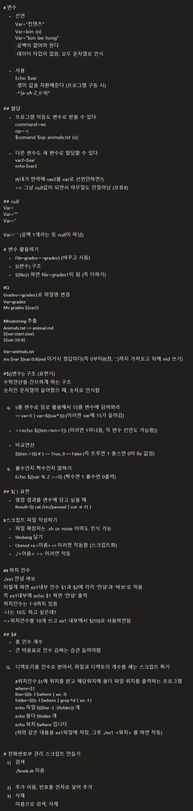

# 변수 
	- 선언
	Var="컨텐츠"
	Var=kim (o)
	Var="kim lee hong"
	-공백이 없어야 한다
	-데이터 타입이 없음. 모두 문자열로 인식

	- 사용
	Echo $var
	-셸이 값을 치환해준다 (프로그램 구동 시)
	-^[a-zA-Z_0-9]*

## 할당
	- 프로그램 이듬도 변수로 받을 수 있다
	command=wc
	op=-c
	$comand $op animals.txt (o)

	- 다른 변수도 새 변수로 할당할 수 있다
	var2=$var
	echo $var2

	If(내가 만약에 var2를 var로 선언안하면?)
	=> 그냥 null값이 되면서 아무일도 안일어남 (오류X)

## null
Var=
Var=""
Var=''

Var=' ' (공백 1개라는 뜻 null이 아님)

# 변수 활용하기
	- File=grades = >grades1 (바꾸고 시픔)
	- ${변수} 구조
	- ${file}1 하면 file=grades1이 됨 (즉 더하기)

#Q
Grades=>grades1로 파일명 변경
Var=grades
Mv grades ${var}1

##substring 추출
Animals.txt => animal.md
${var:start:size}
${var:10:4} 

Var=animals.txt
mv $var ${var:0:8}md 이거시 정답이다(즉 0부터8(점, '.')까지 가져오고 뒤에 md 쓰기)

#$((변수)) 구조 (표현식)
수학연산을 간으하게 하는 구조
숫자인 문자열이 들어왔으 때, 숫자로 인식함

	q. 5를 변수로 담로 활용해서 15를 변수에 담아봐라
	=> var=5 | var=$((var*3)) (이러면 var에 15가 들어감)

	- =>echo $((ten=ten+1)) (이러면 1이나옴, 즉 변수 선언도 가능함))

	- 비교연산
	$((ten > 0)) # 1 == True, 0 == False (즉 트루면 1 폴스면 0이 fix 값임)

	q. 홀수인지 짝수인지 말하기 
	Echo $((var % 2 ==0) (짝수면 1 홀수면 0출력)

## $( ) 표현
	- 명령 결과를 변수에 담고 싶을 때
	Result=$( cat /etc/passwd | cut -d -f1 )

#스크립트 파일 작성하기
	- 파일 확장자는 .sh or none 이여도 인식 가능
	- Shebang 달기
	- Chmod +x <이름> => 이러면 작동함 (스크립트화)
	- ./<이름> => 이러면 작동

## 위치 인수
./ex1 안녕 바보
이렇게 하면 ex1내부 인수 $1과 $2에 각각 '안녕'과 '바보'로 적용
즉 ex1내부에 echo $1 하면 '안녕' 출력
위치인수는 1-9까지 있음
-나는 10도 하고 싶은데?
=>위치인수를 10개 쓰고 ex1 내부에서 ${10}로 사용하면됨 

## $#
	- 총 인수 개수
	- 큰 따옴표로 인수 감싸는 습관 들여야함 

	Q. 디랙토리를 인수로 받아서, 파일과 디렉토리 개수를 세는 스크립트 짜기

	#위치인수 $1에 위치를 받고 해당위치에 폴더 파일 위치를 출력하는 프로그램
	where=$1
	line=$(ls -l $where | wc -l)
	folder=$(ls -l $where | grep ^d | wc -l )
	echo 파일 $((line -1 -$folder)) 개
	echo 폴더 $folder 개
	echo 위치 $where 입니다
	(위와 같은 내용을 ex1파일에 저장, 그후 ./ex1 <위치> 를 하면 작동)

# 전화번호부 관리 스크립트 만들기
	1) 검색
	./book.sh 이름

	2) 추가 이름, 번호를 인자로 넣어 추가
	3) 삭제
	이름으로 검색, 삭제

