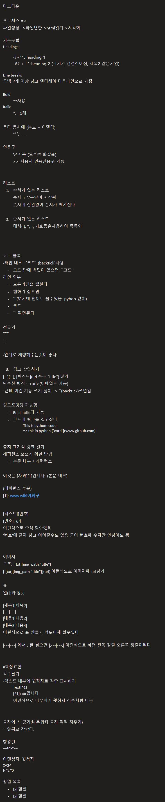

마크다운

프로세스 => 
파일생성 ->파일변환->html읽기->시각화

기본문법
Headings

	-# + ' ' : heading 1
	-## + ' ' :heading 2 (크기가 점점작아짐, 제목2 같은거임)

Line breaks
공백 2개 이상 넣고 엔터해야 다음라인으로 가짐

Bold 
	**사용
Italic
	*, _ 1개

둘다 동시에 (볼드 + 이텔릭)
	***, ___

인용구
	'>' 사용 (오른쪽 화살표)
	>> 사용시 인용인용구 가능


리스트
	1. 순서가 있는 리스트
	숫자 + '.'문단이 시작됨
	숫자에 상관없이 순서가 매겨진다

	2. 순서가 없는 리스트
	대시(-), *, +, 기호등을사용하여 목록화


코드 블록
-라인 내부 : `코드` (backtick)사용
	- 코드 안에 백팃이 있으면, ``코드``
라인 외부
	- 모든라인을 탭한다
	- 탭하기 싫으면
	- ```(여기에 언어도 쓸수있음, pyhon 같이)
	- 코드
	- ``` 짜면된다

선긋기
***
---
---

-앞뒤로 개행해주는것이 좋다

	8. 링크 삽입하기
[...](...), [텍스트](url 주소 "title") 넣기 
단순한 방식 : <url>(이메일도 가능)
-근데 이런 기능 쓰기 싫어 -> ''(backtick)쓰면됨

링크포멧팅 가능함
	- Bold italic 다 가능 
	- 코드에 링크를 걸고싶다
		This is pythom code
		=> this is python [`cord`](www.github.com)


출쳐 표기식 링크 걸기
레퍼런스 모으기 위한 방법
	- 본문 내부 / 레퍼런스

이것은 [사과][1]입니다. (본문 내부)

(레퍼런스 부분)
[1]: www.wiki어쩌구 


[텍스트][번호]
[번호]: url 
이런식으로 주석 할수있음
'번호'에 글자 넣고 이어줄수도 있음 굳이 번호에 숫자만 안넣어도 됨


이미지
구조: ![txt][img_path "title"]
[![txt][img_path "title"]](url) 이런식으로 이미지에 url넣기

표
열(|)과 행(-)

|제목1|제목2|
|---|---|
|내용1|내용2|
|내용3|내용4|
이런식으로 표 만들기 너도이제 할수있다  

|---|---| 에서 : 를 넣으면 |:---|---:| 이런식으로 하면 왼쪽 정렬 오른쪽 정렬이된다


#확장표현
각주달기
-택스트 내부에 윗첨자로 각주 표시하기
	Text[^1]
	[^1]: txt입니다
	이런식으로 나무위키 윗첨자 각주처럼 나옴


글자에 선 긋기(나무위키 글자 찍찍 지우기)
~~앞뒤로 감싼다.

형광펜
==text==

아랫첨자, 윗첨자
X^2^
H~2~0

할일 목록
	- [x] 할일
	- [x] 할일
